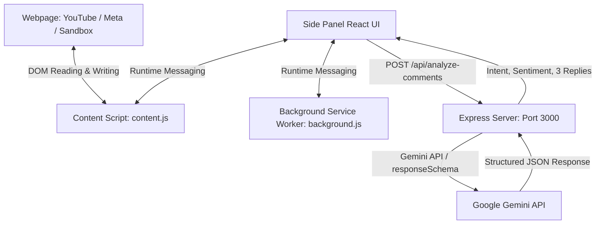

# Programming Hero AI Comment Reply Assistant

A production-grade, highly secure, context-aware Chrome Extension and Node.js backend server designed for the Programming Hero social media and community management teams. 

The application automatically reads comment structures and related video or post details on **YouTube Studio** and **Meta Business Suite (Facebook Comments)**, performs AI classification, sentiment analysis, and intent matching, and generates 3 tailored response options. 

*Note: For security and policy compliance, this extension does NOT automatically post replies; all operations are manual review & click-to-insert.*

---

## Key Features

1. **Workspace Auto-Detection**: Dynamically detects active platform (YouTube Studio, Meta Business Suite, or Local Sandbox).
2. **Context-Aware Generation**: The AI analyzes the comments *in relation to the original content context* (video title, description, post captions).
3. **Structured Classification**: Auto-extracts comment intent, priority, sentiment, and filters out obvious spam.
4. **Banglish / Multi-Language Support**: Automatically matches the language style of the commenter (e.g. script-matching, natural Banglish, formal Bangla, or friendly English).
5. **No Hallucinations**: Constrained to never invent links, dates, product prices, or make false brand promises.
6. **Multi-Variation Replies**: Generates three options for every comment:
   * **Option A**: Natural / default response.
   * **Option B**: Shorter, concise response.
   * **Option C**: Slightly more conversational/friendly response.
7. **DOM Reply Inserter**: Locates corresponding textareas/inputs on active tabs and programmatically inputs text (without auto-posting).
8. **Interactive Mock Testing Sandbox**: Built-in mock page allowing full feature tests without any accounts.

---

## Project Structure

```text
ph-ai-reply-assistant/ (d:/Mahfuz/Project/Comment Reply)
├── extension/
│   ├── public/
│   │   ├── icon16.png / icon48.png / icon128.png    # App Icons
│   │   ├── manifest.json                             # Extension Config (MV3)
│   │   ├── sidepanel.html                            # Side Panel HTML Entry
│   │   └── mock-sandbox.html                         # Offline Sandbox Page
│   ├── src/
│   │   ├── background/
│   │   │   └── serviceWorker.ts                      # Background Service Worker
│   │   ├── content/
│   │   │   ├── index.ts                              # Content Script Entry
│   │   │   ├── platformDetector.ts                   # URL classifier
│   │   │   ├── adapterInterface.ts                   # Platform contract
│   │   │   ├── youtube/YouTubeAdapter.ts            # YouTube DOM extractor & inserter
│   │   │   ├── meta/MetaAdapter.ts                  # Meta/FB DOM extractor & inserter
│   │   │   └── mock/MockAdapter.ts                  # Sandbox DOM extractor
│   │   ├── sidepanel/
│   │   │   ├── App.tsx                               # Side panel UI controller
│   │   │   ├── index.css                             # Global styles (Tailwind)
│   │   │   └── components/                           # Reusable React components
│   │   ├── popup/
│   │   │   ├── App.tsx                               # Popup UI controller
│   │   │   └── main.tsx                              # Popup Entry script
│   │   └── shared/
│   │       ├── types.ts                              # Shared typescript types
│   │       └── constants.ts                          # Brand voice defaults
│   └── package.json
│
├── server/
│   ├── src/
│   │   ├── index.ts                                  # Express Entry point
│   │   ├── config.ts                                 # Env config parser
│   │   ├── prompt/systemPrompt.ts                    # AI Brand prompts guidelines
│   │   ├── services/                                 # AI providers (Gemini, OpenAI)
│   │   └── routes/analyze.ts                         # Analysis POST route
│   ├── .env.example                                  # Env Template
│   └── package.json
```

---

## System Architecture Flow



---

## Getting Started

### 1. Prerequisites
Ensure you have **Node.js (v18+)** installed.

---

### 2. Backend Server Setup

1. Open a terminal and navigate to the `server/` directory:
   ```bash
   cd server
   ```
2. Install dependencies:
   ```bash
   npm install
   ```
3. Create your local environment configuration file:
   ```bash
   cp .env.example .env
   ```
4. Edit the `.env` file and insert your Google AI Studio API Key:
   ```env
   PORT=3000
   GEMINI_API_KEY=AIzaSyYourGeminiApiKeyHere...
   ```
5. Start the server in development mode:
   ```bash
   npm run dev
   ```
   *The server will spin up on [http://localhost:3000](http://localhost:3000).*

---

### 3. Chrome Extension Installation & Setup

1. Open your terminal and navigate to the `extension/` directory:
   ```bash
   cd extension
   ```
2. Install packages:
   ```bash
   npm install
   ```
3. Compile the extension bundle:
   ```bash
   npm run build
   ```
   *This compiles the React files using Vite, compiles scripts using esbuild, and outputs everything to the `extension/dist/` directory.*
4. Install in Chrome:
   * Open Chrome and navigate to `chrome://extensions/`.
   * Enable **"Developer mode"** (top-right toggle switch).
   * Click **"Load unpacked"** (top-left button).
   * Choose the compiled **`extension/dist`** folder from the file dialogue.

---

## Testing Offline via Sandbox

We have built a dedicated test suite sandbox.
1. Open the sandbox in Chrome:
   * Copy the Extension ID from `chrome://extensions/` for **Programming Hero AI Reply Assistant**.
   * Enter the URL in Chrome: `chrome-extension://<EXTENSION-ID>/mock-sandbox.html` (replace `<EXTENSION-ID>` with your extension's actual ID).
   * Or simply double-click and open the file [mock-sandbox.html](file:///d:/Mahfuz/Project/Comment%20Reply/extension/public/mock-sandbox.html) locally.
2. Open the Extension Side Panel (either click the extension toolbar icon or select it from Chrome's Side Panel dropdown menu).
3. Select **"Analyze First 5 Comments"** to extract mock comments and generate reply options.
4. Try clicking **"Insert Reply"** on the card options to see the text automatically fill inside the mock textarea elements on the sandbox page!

---

## Settings Customizations

From the Side Panel top-right, click the **Gear Icon** to customize:
* **Server endpoint URL**
* **Brand Name** (e.g. Programming Hero)
* **Tone of replies**
* **Canned words to avoid** (e.g., "আপনার মূল্যবান প্রশ্নের জন্য ধন্যবাদ")
* **Preferred phrases**
* **Advanced Developer Debug Mode** (lists extracted comment details and matching IDs).
* **Reset Defaults** / **Clear Storage**.

---

## Known Constraints & Roadmap

* **Platform Changes**: If YouTube Studio or Facebook Business Suite alters their UI class structure, adapt selectors in [`YouTubeAdapter.ts`](file:///d:/Mahfuz/Project/Comment%20Reply/extension/src/content/youtube/YouTubeAdapter.ts) and [`MetaAdapter.ts`](file:///d:/Mahfuz/Project/Comment%20Reply/extension/src/content/meta/MetaAdapter.ts).
* **Instagram Support**: The extension's architecture is fully compatible and is planned to support Instagram inbox comment rows inside Meta Inbox.
# AI-Comment-Reply-Assistant

